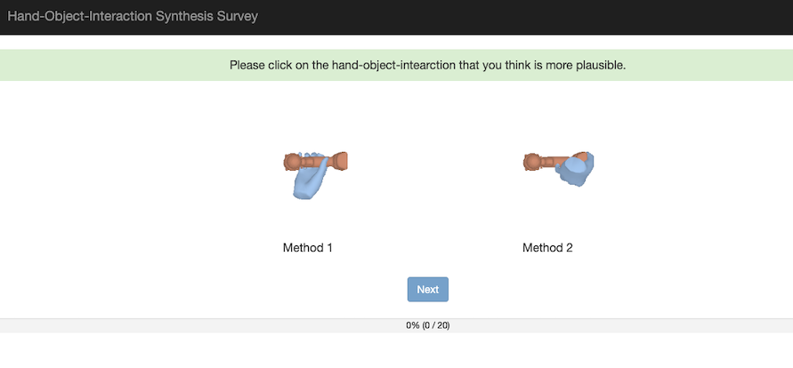
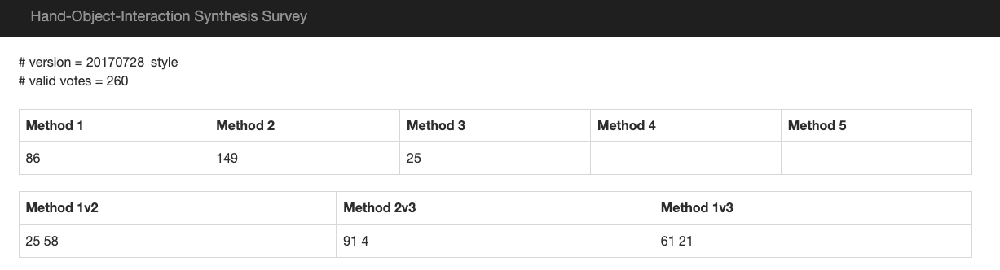

# User Study
Credit to [Xueting Li](https://sunshineatnoon.github.io/)

## What is it? 
An AB test user study website. Each survey consists of 20 questions whose answers are sampled from N methods. Here is the interface: 

Instruction page:

Survey page:

Result page:


## Install environment
conda create -n userstudy python=3.9
pip install django==1.8
pip install hashids

## How to use it?
- Put results from different methods under `userstudy/static/data/`. This code assumes the following structure:
    ```
    userstudy/static/data/
        1/
            1.png # or gif
            2.png
            ...
        2/
        ....
    ```
- Change some parameters in `view.py` e.g. the number of your methods. There are some other functions that are also very easy to customize, like how to sample methods, how to analyze results.
- Change you instruction page in `index.html`.
- Bring it live: `python manage.py runserver 0.0.0.0:port`
- Check results: go to `hostname:port/dump`
- Clear database: `python manage.py flush`

---
Have fun! 
    
